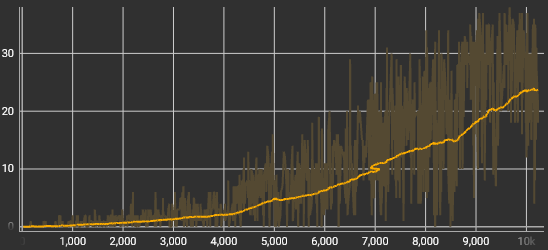

#  🐍Snake Game🐍

Description

## Table of Contents
  - [Prerequisites](#prerequisites)
  - [Usage](#usage)
  - [Configuration](#configuration)
  - [Results](#results)
  - [Contact Information](#contact-information)

## Prerequisites

-NumPy<br>
-TensorFlow and Keras (Keras included with TensorFlow 2.0 or later)<br>
-Other imports are from the Python standard library

    pip install numpy
    pip install tensorflow

## Usage

  Just clone the matopeli.py file, if you want to train your own model. If you want to try the model provided also clone the "model" folder.<br>
  The model folder and the .py file need to be in the same directory.

  Upon running matopeli.py you will be prompted to train or test.<br>
  If testing is chosen the program will automatically load a model that is stored in a model/ folder in the same directory.

  If Training is chosen you will be prompted to choose to train a new model or continue training an old one from a cache/ folder.<br>
  While training, the program will periodically save the model to a cache/ folder in the same directory in case of any interruptions.<br>
  
  The model will also save logs of the training session, that might be of interest.<br>
  The logs will contain values for:<br>
  - Episode Cycles: Number of cycles per episode
  - Eouside Reward: Total Reward given to the agent per episode
  - Epsilon: Current Epsilon value for the episode
  - Loss: Value of the Loss function per episode
  - Points Eaten: The amount of points the agent has eaten per episode<br>
  
  The logs are saved to a logs/ folder in the same directory as matopeli.py. The log folders for different models are named by the datetime at the time of starting training, for example 20231030-162719<br>
  
  When continuing training an existing (old) model, the program will load a model from cache/ and prompts to give logdir (eg. 20231030-162719), previous episodes ran and epsilon value at the time of termination. This is so that the logs can continue from where they left off. (I don't care to make it work automatically as you shouldn't need to interrupt training much)<br>
  
  The logs are viewed using tensorboard, which can be activated by following command in the same directory as matopeli.py:
  ```
    tensorboard --logdir="logs/"
  ```
  Then tensorboard will give an url where you can view the logs, which is likely http://localhost:6006/

## Configuration

  For training the hyperparameters in trainNN function can be modified however.

  Values for normal configuration:<br>
  - number_of_episodes: The number of episodes that the training process goes through
  - alpha: The learning rate
  - gamma: Discount factor
  - epsilon_min: minimum epsilon value (Note that minimum value changes throughout training and has to be changed there too)
  - epsilon_decay: the rate at which epsilon decays over the episodes (to balance exploration vs exploitation)
  - batch: batch size for the experience replay
  - fit_period: The period of actions between experience replay
  - buffer maxlen: The maximum length of the experience replay buffer
  - target_update_period: number of episodes between target network updates

  I have come up with the current values by testing in few hour training sessions, so they are atleast pretty good as is.

  Otherwise the neural network architechture can be edited, but by the current implementation the input needs to be 10x10 array.

## Results

Here will be some results and observations from training the model provided.


:c" width="150" height ="200">
Here is one test run I recorded.<br>
It's very hard to analyze the agent based on one recording other than to state that the agent could use some more training as it kills itself in the end for no reason.
On other runs I have observed that the agent sometimes gets cornered inside its body and dies, and that sometimes it avoids getting cornered, but it is hard to figure out whether it avoided getting cornered on purpose or by accident.

### Points Eaten
<br>
Points eaten by the agent during training provided by tensorboard over 10k games of snake.<br>
Highscore during this training period was 38 points eaten

### Episode Cycles
<br>
Cycles per game of snake over 10k games.<br> 

The cycles and points eaten correlate well in this training period. I was aiming for that in my configurations because previously I had issues with the average cycles increasing too fast and it resulted to the agent just trying to stay alive and not eating points (stuck running circles).

### Loss
<br>
Loss function value (MSE) over 10k games of snake.

The Loss function seems to have started to grasp the policy in the later episodes and it started a downward trend.<br>
It is typical for a DQN to have fluctuating loss function values in the beginning


I do not think that this configuration is capable of completing the game, however it is a good baseline and more training could still take it a lot further


## Contact Information

- Joona Korkeamäki
- joona.v.korkeamaki@tuni.fi
    
  
  

  
